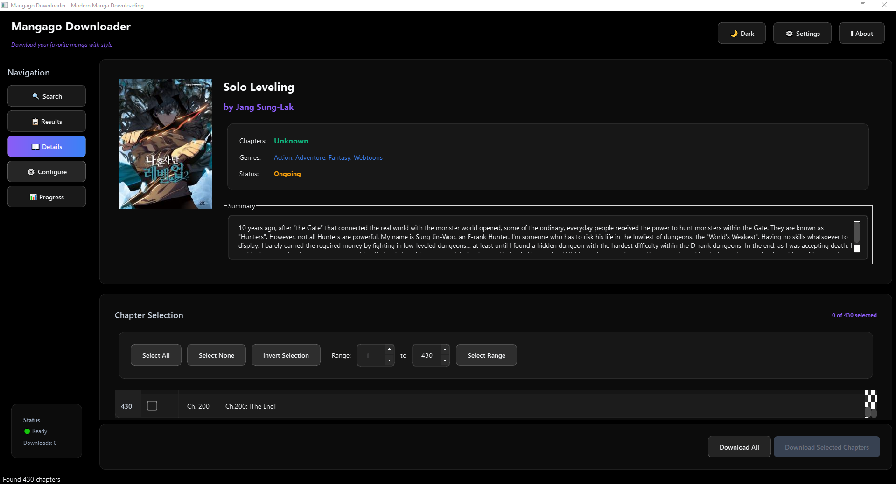

# Mangago Downloader

A modern manga downloader for Mangago.me featuring both a beautiful interactive CLI (Typer + Rich) and a sleek GUI. Supports search, downloads, chapter selection, PDF/CBZ conversion, and threaded parallel downloads.

## Features

- 🔍 Search: Search manga by title, displaying results with index, title, author, genre, and total chapters.
- ⬇️ Download: Select all chapters, a single chapter, or a range of chapters.
- ⚡ Threading: Parallel and concurrent downloads for speed.
- 📚 Conversion: Save as PDF or CBZ.
- 🗑️ Cleanup: Option to delete images after successful conversion.
- 🎨 **User Interfaces:**
  - **CLI (Command Line Interface):** Built with `Typer` and `Rich`, offering a fully interactive, menu-driven experience with rich tables, live progress bars, and stylized prompts.
 - **GUI (Graphical User Interface):** Developed using `PyQt6`, providing a modern, sleek, and intuitive visual interface with dedicated sections for Search, Details, Configuration, and Progress monitoring.

## Installation

1. Clone the repository:
   ```bash
   git clone https://github.com/Yui007/mangago_downloader.git
   cd mangago_downloader
   ```

2. Install the required dependencies:
   ```bash
   pip install -e .
   ```

   Or install dependencies directly:
   ```bash
   pip install httpx beautifulsoup4 typer rich PyQt6 img2pdf Pillow selenium
   ```

3. Install ChromeDriver:
   - Download ChromeDriver from https://chromedriver.chromium.org/
   - Add ChromeDriver to your system PATH
   - Or place ChromeDriver in the project directory

## Usage

### CLI Interface

Run the interactive CLI:
```bash
python -m cli.main_cli
```

Or using the launcher:
```bash
python launcher.py
```

Or if installed as a package:
```bash
mangago-downloader
```

The CLI will guide you through:
1. Searching for manga by title
2. Selecting a manga from the search results
3. Choosing which chapters to download
4. Selecting the output format (PDF or CBZ)
5. Deciding whether to delete images after conversion

### GUI Interface

Run the GUI application:
```bash
python -m gui.main_gui
```

Or using the launcher:
```bash
python launcher.py --gui
```

Or if installed as a package:
```bash
mangago-downloader-gui
```

The GUI provides a comprehensive visual interface with the following key sections:
- **Search Section:** Search for manga by title or direct URL.
- **Details Section:** View manga details, including cover art and chapter list, and select chapters for download.
- **Configure Section:** Customize download settings (location, concurrent downloads, retry, timeout, overwrite) and select output format (Images Only, PDF, CBZ). Settings are saved automatically.
- **Progress Section:** Monitor the real-time progress of ongoing downloads and conversions.

Here's a preview of the GUI:


## Project Structure

```
mangago_downloader/
│
│── cli/
│   └── main_cli.py        # Typer + Rich interactive menu
│
│── gui/
│   ├── __init__.py        # GUI package initialization
│   ├── main_gui.py        # PyQt6 application entry point
│   ├── main_window.py     # Main application window
│   ├── search_widget.py   # Search interface components
│   ├── results_widget.py  # Results display components
│   ├── details_widget.py  # Manga details components
│   ├── download_widget.py # Download configuration components
│   ├── progress_widget.py # Progress tracking components
│   ├── config.py          # Configuration management
│   ├── controllers.py     # Business logic controllers
│   ├── workers.py         # Background workers
│   └── styles.py          # Styling and themes
│
│── src/
│   ├── search.py          # Manga search logic
│   ├── downloader.py      # Core download + threading
│   ├── converter.py       # PDF/CBZ conversion
│   ├── utils.py           # Helpers (headers, requests, paths)
│   └── models.py          # Data classes for Manga, Chapters
│
│── launcher.py            # Unified launcher for CLI/GUI
│── gui_config.json        # GUI configuration file
│── README.md
│── pyproject.toml
│── LICENSE
```

## Dependencies

- Python 3.11+
- httpx (for HTTP requests)
- BeautifulSoup4 (for HTML parsing)
- Typer (for CLI)
- Rich (for CLI interface)
- PyQt6 (for GUI)
- img2pdf (for PDF conversion)
- Pillow (for image processing)
- selenium (for web scraping)
- zipfile (built-in, for CBZ conversion)

## License

This project is licensed under the MIT License - see the LICENSE file for details.